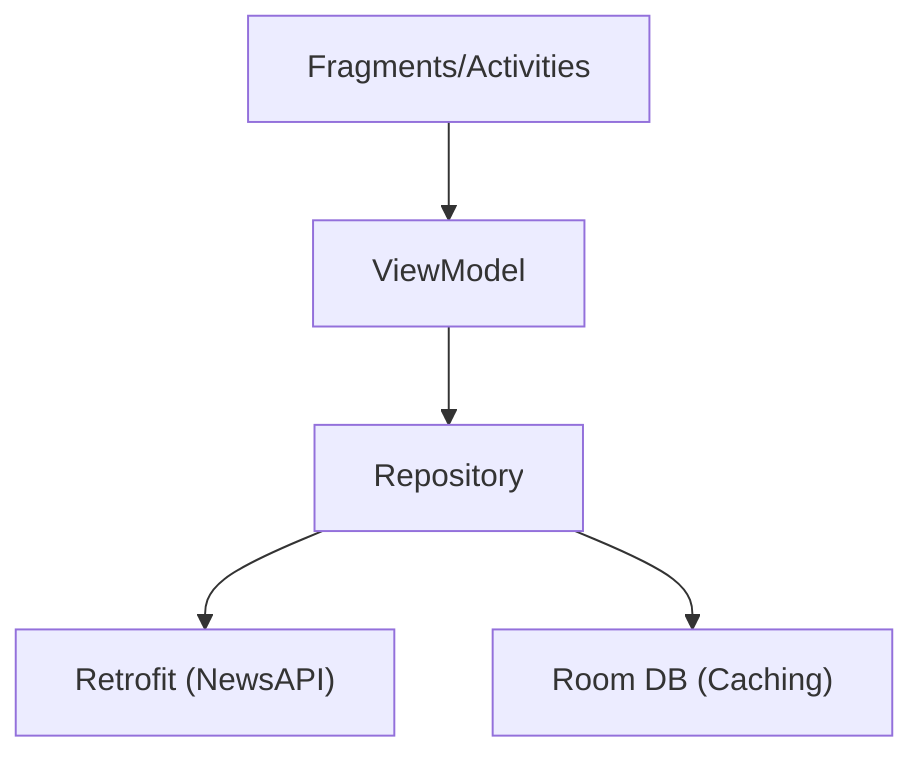

# 📰 News App 


> 🚀 **Proudly developed during the internship at Technook** 

A state-of-the-art **News Application** crafted with modern Android development practices. This app delivers a premium user experience with real-time updates, offline caching, and a stunning "Glassmorphism" inspired UI..

## ✨ Key Features

### 🌟 Unique "Wow" Factors
- **🥇 Developer Badge**: A Gold Gradient Badge in the *About* screen recognizing the Technook Internship.
- **⏱️ Smart Reading Time**: AI-inspired logic calculating estimated reading time for every article.
- **🎨 Gradient Aesthetics**: A visual treat with Gold & Purple gradients.

### � Core Functionality
- **Top Headlines**: Breaking news from 100+ sources.
- **Categories**: Filter by Business, Tech, Health, and more.
- **Search**: Powerful search engine for topics of interest.
- **Offline Mode**: Save articles to Favourites (Room Database).
- **Immersive Reading**: Built-in WebView with sharing capabilities.

## 🏗️ Architecture

The app follows the **MVVM (Model-View-ViewModel)** pattern to ensure separation of concerns and testability.




## � Libraries & Tools

| Library | Purpose |
| :--- | :--- |
| [**Retrofit2**](https://square.github.io/retrofit/) | A type-safe HTTP client for Android to handle API requests. |
| [**Room**](https://developer.android.com/training/data-storage/room) | Persistence library provides an abstraction layer over SQLite. |
| [**Glide**](https://github.com/bumptech/glide) | A fast and efficient open source media management and image loading framework. |
| [**Coroutines**](https://developer.android.com/kotlin/coroutines) | Concurrency design pattern that you can use on Android to simplify code that executes asynchronously. |
| [**Navigation**](https://developer.android.com/guide/navigation) | Framework for navigating between 'destinations' within an Android application. |
| [**Shimmer**](https://facebook.github.io/shimmer-android/) | An Android library that provides an easy way to add a shimmer effect. |

## 🔮 Roadmap (Future Enhancements)

- [ ] **Onboarding Screen**: A professional welcome slider for new users.
- [ ] **Search History**: Save recent searches for quick access.
- [ ] **Offline Banner**: Dedicated status indicator for connectivity loss.
- [ ] **Dark Mode**: Full system-wide dark theme support.

## �🚀 Installation

1.  Clone the repository:
    ```bash
    git clone https://github.com/Ajaykannagit/newsApp.git
    ```
2.  Open the project in **Android Studio**.
3.  Add your API Key in `local.properties`:
    ```properties
    apiKey=YOUR_NEWSAPI_KEY
    ```
4.  Build and Run.

## 🤝 Contribution
Contributions are welcome! Please fork this repository and contribute back using pull requests.

Any contributions you make are **greatly appreciated**.

---
<div align="center">
    <b>Built with ❤️ by <a href="https://github.com/Ajaykannagit">Ajay kanna A</a></b><br>
    <i>Intern at Technook</i>
</div>
